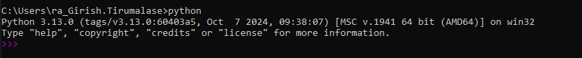

# Python fundamentals

## Python installation

1. Download and install the [latest python version](https://www.python.org/downloads/) for windows machine.

1. check the version of python installed

    ```cmd
    python --version
    ```

1. If any errors check where python is installed and add that folder path to system environment variable PATH. This should make python run from anywhere in your system.

    ```cmd
    where python
    ```

1. Open Command Prompt and check if python interpreter is up and running

    ```cmd
    python
    ```

    

## Configure Visual studio code to wrok on python

1. Add the Python, Pylance Extensions from Microsoft, if it not already installed.
1. go to Menu option in VSCode and select the right version of python interpreter.
below is the menu navigation View -> Command Palette -> Select: Python Interpreter.
1. VSCode is set for working on python projects.

## Create virtual environment

to avoid conflicts between multiple applications depending on different versions of a given package or libraries, create virtual environment specific to each project. this virtual environment helps to separate the installable dependencies by project.

1. The below command is used to crate a virtual environment in the python project. This creates a folder with name **venv** in the project directory.

    ```pshell
    python -m venv venv
    ```

1. Activate the virtual environment by executing the activate command

    ```pshell
    # on windows machine activate the virtual environment in the project with running the activate script.
    ./venv/scripts/activate
    ```

1. install the required packages through pip.

    for *example*: install the *requests* package with below command

    ```pshell
    pip3 install requests
    ```

1. Execute the required programs and make sure all the packages are installed in the virtual environment.

1. Deactivate the virtual environment, when its not needed anymore.

    ```pshell
    rm ./venv
    # say Yes for the following option to deleted the virtual environment.
    ```

## fast api

Refer to [fast api section](./fundamentals/basics/fast_api/ReadMe.md#fast-api) of the documentation.

## Unit tests

Unit tests are meant to help the code testing easy, covering all the possible workflows and identify the breakages early in developement.

Run the unit tests from the root project folder.

The below command runs specific tests  from given unit test file `test_circle_area.py` from `tests` folder

```cmd
python -m unittest .\fundamentals\basics\tests\test_circle_area.py
```

For more details refer [unit test](fundamentals/basics/tests/ReadMe.md) documentation.
